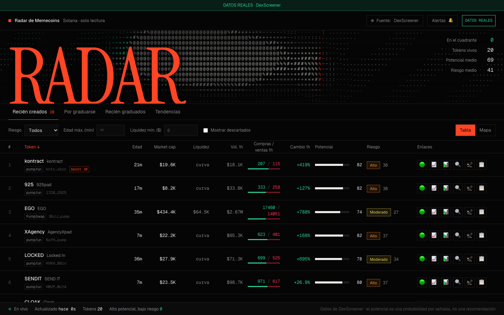
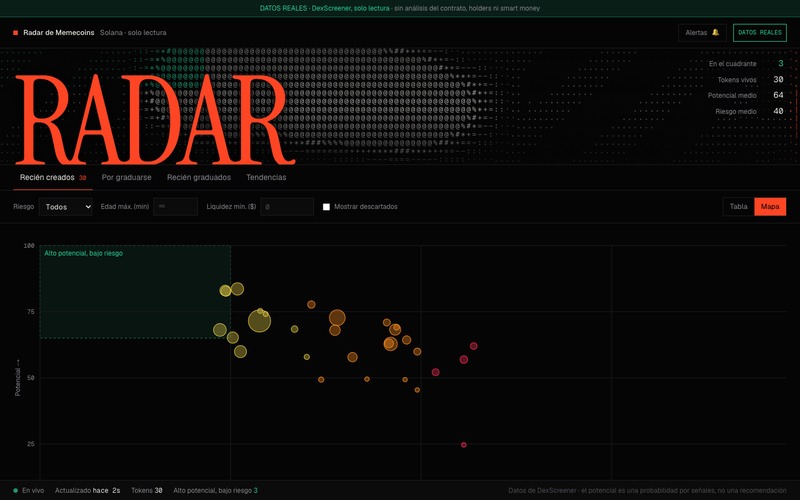
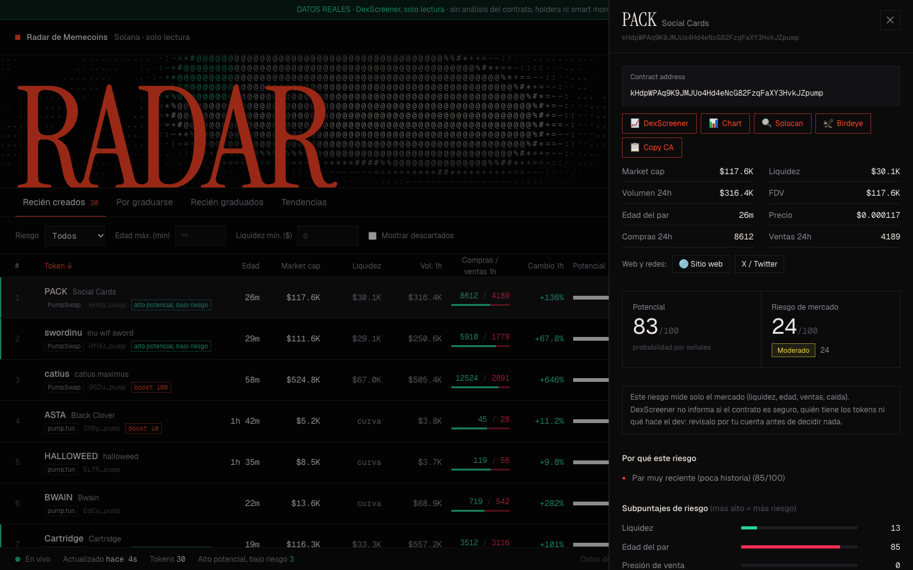

# PULSAR RADAR

**Radar de memecoins de Solana en tiempo real: muestra el potencial y el riesgo de mercado de cada token desde sus primeros minutos.**

**[▶ Probar la demo en vivo](https://miguelangel213.github.io/pulsar-radar/)**

## Qué hace

- **Encuentra memecoins de Solana** recién creados, a punto de graduarse, recién graduados y en tendencia.
- **Les da dos puntuaciones de 0 a 100**: *potencial* (señales de mercado) y *riesgo de mercado*, con el detalle de cómo se calcula cada una.
- **Ordena todo del mejor al más riesgoso** y marca los tokens de *alto potencial y bajo riesgo*.
- **Mapa visual** que coloca cada token según su potencial y su riesgo.
- **Ficha de cada token** con market cap, liquidez, volumen, edad, compras y ventas, sitio web y redes.
- **Enlaces rápidos** a DexScreener, el gráfico, Solscan y Birdeye, y botón para copiar el contract address.
- **Alertas** visuales y sonoras cuando un token entra a la zona de alto potencial y bajo riesgo.
- **Funciona en el móvil** y se actualiza solo.

| Mapa potencial vs. riesgo | Ficha de un token |
|---|---|
|  |  |

## Aviso

Proyecto educativo y de **solo lectura**: no compra ni vende nada. Los datos vienen de DexScreener y no incluyen la seguridad del contrato, quién tiene los tokens ni qué hace el creador, así que un token con riesgo bajo puede seguir siendo una estafa. El potencial es una probabilidad basada en señales de mercado: no predice precios ni es una recomendación de compra.

## Licencia

[MIT](LICENSE)
