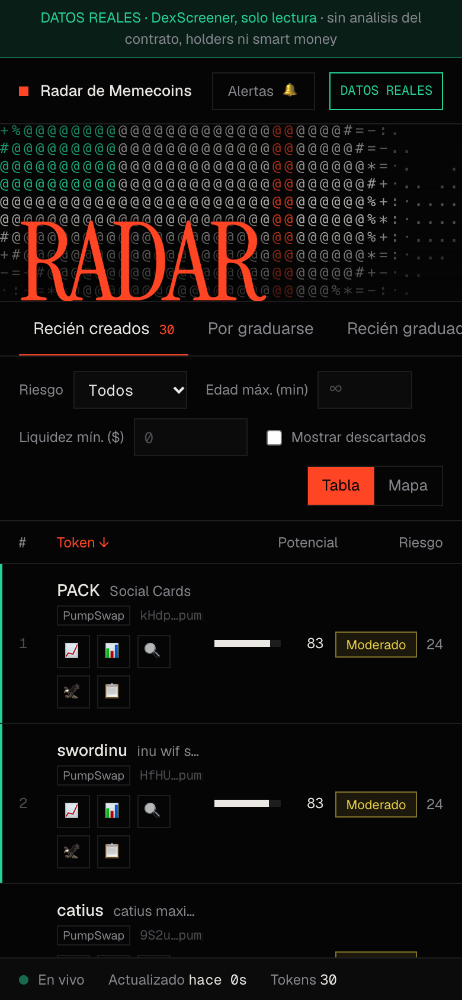

<div align="center">

# PULSAR RADAR

**Radar de memecoins de Solana en tiempo real: puntúa potencial y riesgo de mercado desde el minuto cero.**

Solo lectura · datos reales de DexScreener · sin API key · sin servicios de pago

</div>


## Qué hace

- **Descubre tokens** de Solana a partir de los boosts y perfiles de DexScreener, los detalla en lotes y los vuelve a escanear cada 15 s.
- **Los puntúa con reglas explícitas** (sin ML): un *potencial* y un *riesgo de mercado* de 0 a 100, cada uno con sus subpuntajes visibles, y un ranking ajustado por riesgo.
- **Hard gates**: descarta o marca en rojo los tokens con liquidez mínima, actividad insuficiente, caídas bruscas o muro de ventas.
- **Guarda el histórico en SQLite** cada minuto, aunque no haya ningún navegador abierto, para poder medir después qué señales funcionaron.
- **Alertas** visuales y sonoras cuando un token entra al cuadrante *alto potencial, bajo riesgo*.
- **Enlaces rápidos por token**: DexScreener, chart, Solscan, Birdeye y copiar contract address.

| Mapa potencial vs. riesgo | Detalle de un token |
|---|---|
|  |  |

<details>
<summary>Versión móvil</summary>



</details>

## Cómo funciona

```
DexScreener API ──► DexScreenerClient ──► TokenScanner ──► scoring + gates ──► SQLite (radar.db)
 (sin API key)      caché · rate limit     descubre,         potencial, riesgo     tokens + history
                    · backoff              detalla en         cuadrante                 │
                                           lotes de 30                                  ▼
                       hilo de fondo (cada 15 s) ───────────────────────────►  FastAPI  /radar  /alerts ...
                                                                                        │
                                                                                        ▼
                                                                            Next.js + Tailwind (/radar)
```

- **Cliente** ([`clients/dexscreener_client.py`](backend/clients/dexscreener_client.py)): caché con TTL, limitador de ventana deslizante por grupo de endpoints (por debajo de los límites públicos de DexScreener), reintentos con backoff y último dato conocido si la API cae.
- **Hilo de fondo** ([`services/background.py`](backend/services/background.py)): escanea y guarda sin depender del navegador. Un fallo puntual no lo detiene.
- **Scoring** ([`scoring/scoring_engine.py`](backend/scoring/scoring_engine.py)): liquidez, volumen, market cap, edad del par y ratio compras/ventas. Todos los pesos y umbrales viven en [`config/radar.yaml`](backend/config/radar.yaml), nunca en el código.
- **Persistencia** ([`services/db.py`](backend/services/db.py)): tablas `tokens` (último estado) e `history` (serie de precio, market cap, liquidez, volumen y scores).

## Arrancar

Necesitas **Python 3.9+** y **Node 18+**.

```bash
git clone <url-del-repo> && cd <carpeta>
pip install -r backend/requirements.txt
./start.sh            # instala el frontend la primera vez y arranca todo
```

Abre **http://localhost:3000/radar**. (El puerto 8000 es solo la API: en `/` da 404, es normal; la documentación está en `/docs`.)

```bash
cd backend && python3 -m pytest -q     # 56 tests
curl localhost:8000/health             # estado, hilo de fondo y filas guardadas
```

## Endpoints

| Endpoint | Qué devuelve |
|---|---|
| `GET /radar?stage=&risk_level=&max_age=&min_liquidity=&min_mcap=&max_mcap=&sort=&order=` | Tokens puntuados y filtrados |
| `GET /search?q=` | Busca en DexScreener y puntúa (no guarda) |
| `GET /pairs/{address}` | Todos los pools de un token |
| `GET /tokens/{address}` · `/tokens/{address}/history` | Último estado e histórico guardados |
| `GET /alerts?after=` | Alertas nuevas |
| `GET /health` | Estado del escáner, de la base de datos y del hilo de fondo |

## Límites (importante)

- DexScreener **no ofrece un feed de todos los pares nuevos**: el radar solo ve tokens con boost o perfil publicado, más las búsquedas que configures en `scanner.search_queries`.
- DexScreener **no entrega seguridad del contrato, holders, dev ni smart money**. El "riesgo" es solo de mercado y la interfaz lo dice: un token "Sólido" aquí puede seguir siendo una estafa.
- Los pares en *bonding curve* de pump.fun llegan sin liquidez; el score los trata como neutros.
- El potencial es una **probabilidad basada en señales**: no predice precios ni es una recomendación de compra. Proyecto educativo, solo lectura, sin órdenes de compra o venta.

## Estructura

```
backend/   clients/ · services/ · scoring/ · radar/ (config, modelos, caché) · api/ · config/radar.yaml · tests/
frontend/  Next.js 15 + Tailwind 4 (app/radar, components/, hooks/)
docs/      capturas
```
